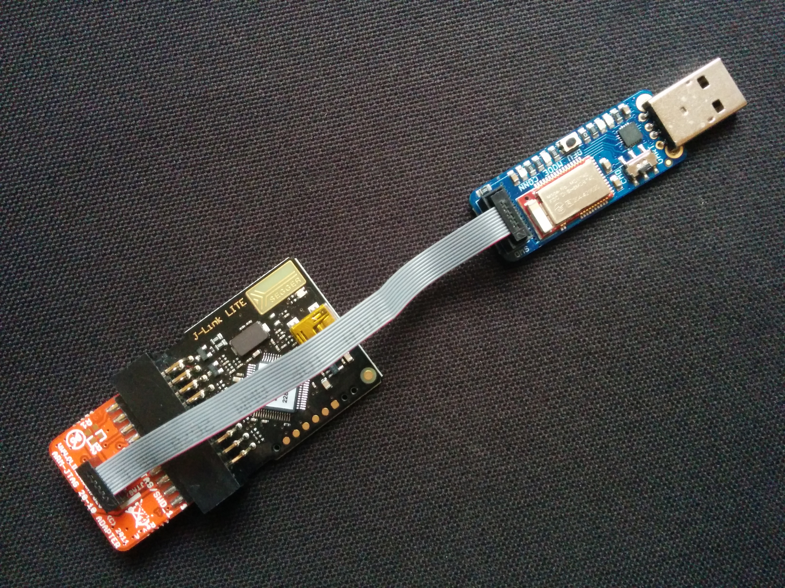
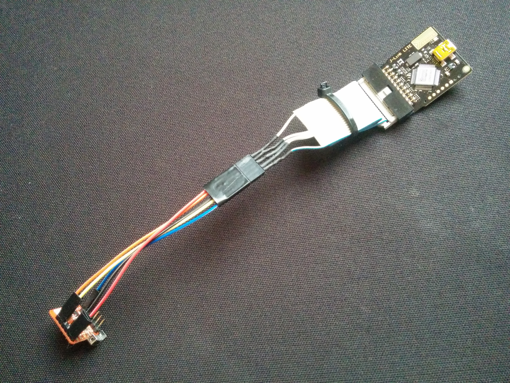

# Onix
Open Source Arduino IDE and library support for nRF51822-based devices.

## What it gives you now
 - build your sketches for nRF51 in the Arduino IDE using familiar APIs
 - get all your nRF51 ROM and RAM back - because it has no bloated or proprietary code or BLE stack

## What is coming soon
 - radio - *lightweight radio with BLE adverts coming soon!*
 - SPI, Wire/I2C, etc - *already written, needs to be sanitised of secret code!*

.. see Roadmap below

## Runs on these devices

<table>
<tr>
<td>
Nordic nRF51 Dongle
  

</td>
<td>
Adafruit Bluefruit LE Friend
  

</td>
</tr>
<tr>
<td>
Waveshare
  

</td>
<td>
RedBear Nano
  

</td>
</tr>
</table>

 - Many more devices coming..

## What it includes
 - an [Arduino nRF51 board config](http://object.network/package\_onix\_nrf51\_index.json)
 - some Arduino-to-nRF51 adaptor code
 - build scripts and tools
 - APIs and example sketches

## Fully Open

Onix is free of secret code by Nordic, RedBear or RFduino

.. although if you spot some, let me know and I'll remove or replace it :-)

## Operating Systems
 - Arduino IDE runs on Linux and Mac (Windows untested)
 - this GitHub source builds using 'make' on Linux

## Building the example
 - if you've not already got it, download the right JLink for your platform from [Segger, here](https://www.segger.com/jlink-software.html)
 - in your Arduino 1.6.5 IDE, add the link to this package config json file: [http://object.network/package\_onix\_nrf51\_index.json](http://object.network/package\_onix\_nrf51\_index.json) in the preferences panel
 - go to "Tools/Board/Boards Manager" and find Onix at the bottom; hit the 'Install' button
 - choose the Nordic, Adafruit, Waveshare or Nano board and check the correct serial port as usual
 - plug in the Nordic or wire the SWD flasher to the Adafruit, Waveshare or Nano (see below)
 - open Examples/Onix/Blinky and build it

## Running it
 - it blinks! if it's a Nordic or Adafruit plug, it blinks in several colours!
 - when you watch in the serial line, you'll see ticking messages; typing 'o' or 'i' changes the blink rate

## Wiring J-Link/SWD to Adafruit, Waveshare or Nano
 - here's what these three look like wired to a Segger J-Link (touch to expand image):
 - &nbsp; &nbsp;  &nbsp; &nbsp; &nbsp; &nbsp;  

 - you may need an adaptor between fat-plug and teensy-plug for the Adafruit - [something like this](https://www.google.co.uk/search?q=Olimex+ARM-JTAG-20-10+10+Pin+JTAG+Adaptor)
 - the Waveshare may work with a straight J-Link cable - I haven't tested it - but otherwise this hand-crafted one is fine
 - you do need to do a bit of soldering for the Nano, because the USB disk approach doesn't seem to work without a softdevice:

 [J-Link pins](https://segger.com/interface-description.html) | [RedBear Nano pins](http://redbearlab.com/blenano/) | wire colour in photo
 -----------:|:----------|:--------
 GND (8)     | GND       | black
 5V pwr (19) | VIN       | red
 SWCLK (9)   | SWCLK     | orange
 SWDIO (7)   | SWDIO     | yellow
 VTref (1)   | VDD (3V3) | blue

 - you need to run JLinkExe and type 'power on perm' to power the Waveshare or Nano from pin 19

## Building the Arduino package on Linux
 - run <code>make</code>, which builds <code>Onix-nRF51.zip</code> and <code>package\_onix\_nrf51\_index.json</code>
 - upload them to your test server and try out the link to the package config json file in the IDE

## Roadmap

Simpler stuff:

 - better basic Arduino API - Serial, buttons; test/port common libraries (Adafruit) using SPI/I2C, etc
 - power management for CR2032-powered tags and sensors
 - more demo examples: tag with accelerometer, wearable lights, RGB Strip, soil moisture sensor, TFT displays, etc
 - running on more devices: more Bluefruits, the Nordic DK and Beacon, [uCXpresso Lilypad](https://international.switch-science.com/catalog/2158/), Seeed devices, RFduino, BBC micro:bit
 - different ways of flashing: OTA/DFU, hobby-grade SWD, getting RedBear's USB disk to work, etc
 - running on Windows, building on Mac and Windows

Harder stuff:

 - raw radio channel API
 - Bluetooth LE advertise/scan-based radio, with frag/defrag, ID beacons, RSSI in API
 - property protocol, objects, notification, proxy-cacheing mesh, with tests
 - IPv6 gateway with attached ENC28J60 ethernet or ESP8266 WiFi
 - network security: encryption, identity

Non-nRF51 platforms:

 - BLE radio API for Android and other Linux with in-built/attached BLE, such as Ubuntu or Pi; other SoC/SoMs
 - IPv6 gateways: on these Android, Ubuntu or Pies with own BLE, or USB serial to nRF51 device

----

----

