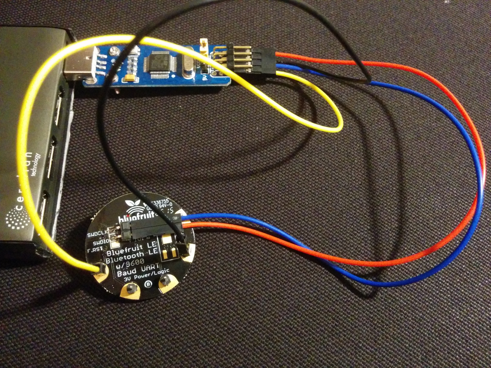
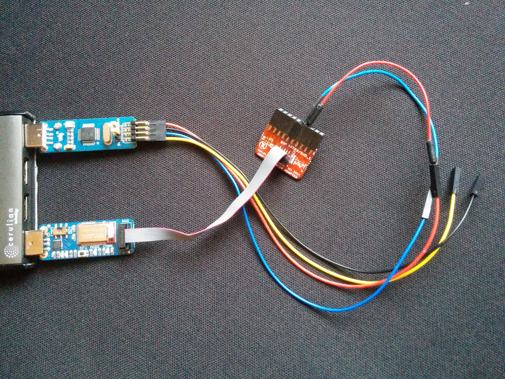
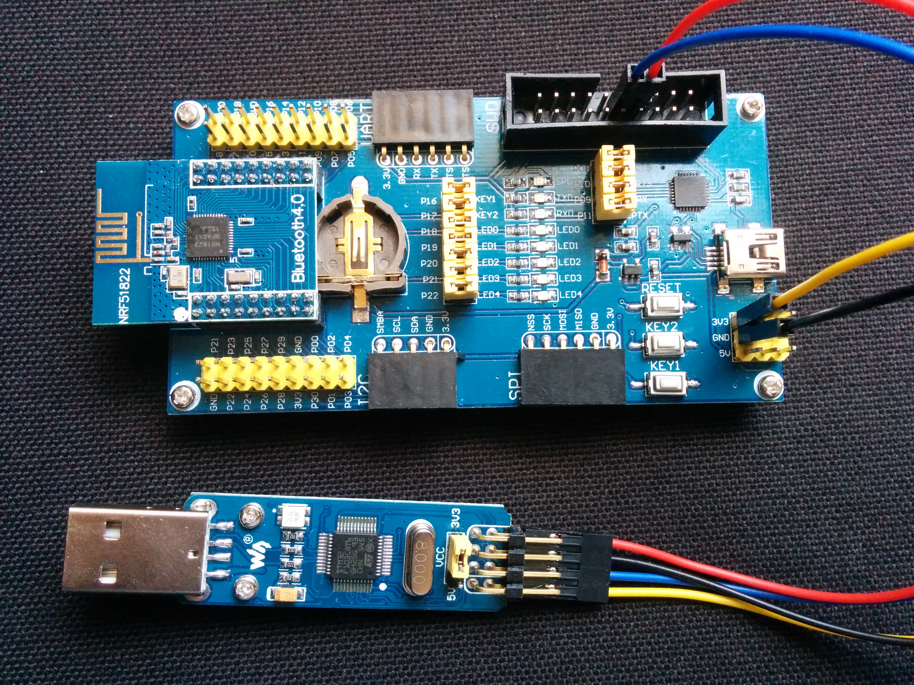
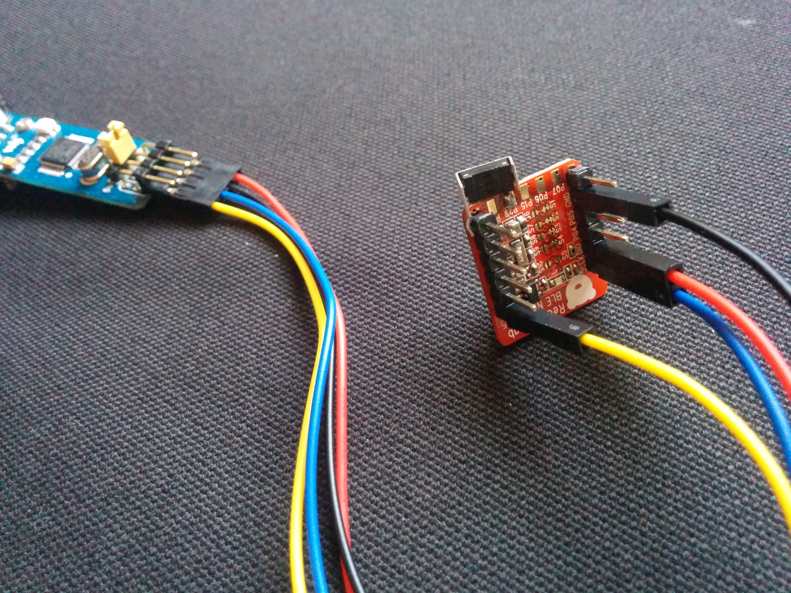
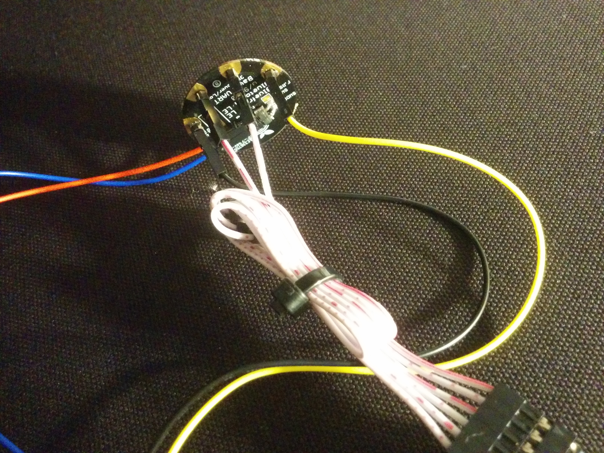
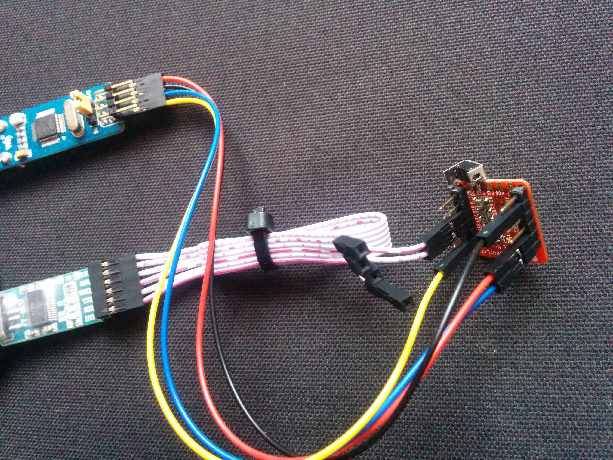

# Onix
Open Source Arduino IDE and library support for nRF51822-based devices.

## What it gives you now
 - build your sketches for nRF51 in the Arduino IDE using familiar APIs
 - get all your nRF51 ROM and RAM back - because it has no bloated or proprietary code or BLE stack

## What is coming soon
 - radio - *lightweight radio with BLE adverts coming soon!*
 - SPI, Wire/I2C, etc - *already written, needs to be sanitised of secret code!*

.. see Roadmap below

## Runs on these devices

<table>
<tr>
<td>
Adafruit Bluefruit Flora
  

</td>
<td>
Adafruit Bluefruit LE Friend
  

</td>
</tr>
<tr>
<td>
Waveshare
  

</td>
<td>
RedBear Nano
  

</td>
</tr>
</table>

 - Many more devices coming..

## What it includes
 - an [Arduino nRF51 board config](http://object.network/package\_onix\_nrf51\_index.json)
 - some Arduino-to-nRF51 adaptor code
 - build scripts and tools
 - APIs and example sketches

## Fully Open

Onix is free of secret code by Nordic, RedBear or RFduino

.. although if you spot some, let me know and I'll remove or replace it :-)

Open flashing (OpenOCD) and cheap, commodity flasher devices. Doesn't use Segger for flashing.

## Operating Systems
 - Arduino IDE runs on Linux and Mac (Windows untested)
 - this GitHub source builds using 'make' on Linux

----------------------------------------------

## What you need
 - Arduino IDE 1.6.7
 - one of those boards above from [Adafruit](https://www.adafruit.com/products/2267), [Waveshare](http://www.waveshare.com/ble400.htm), or [your local supplier](https://proto-pic.co.uk/redbearlab-ble-nano-nrf51822/)
 - an ST-Link/V2 mini to SWD flash your board - from [Adafruit](https://www.adafruit.com/products/2548), [Waveshare](http://www.waveshare.com/ST-LINK-V2-mini-STM32.htm), or [your local supplier](http://hobbycomponents.com/st-micro-electronics/444-stm8-stm32-emulator-and-programmer).

## Building the example
 - in your Arduino 1.6.7 IDE, add the link to this package config json file: [http://object.network/package\_onix\_nrf51\_index.json](http://object.network/package\_onix\_nrf51\_index.json) in the preferences panel
 - go to "Tools/Board/Boards Manager" and find Onix at the bottom; hit the 'Install' button
 - choose a Bluefruit, Waveshare or Nano board
 - wire the ST-Link/V2 flasher to your Bluefruit, Waveshare or Nano (see below)
 - check the correct serial port as usual (if you have that plugged/wired in - see below)
 - open Examples/Onix/Blinky and upload it

## Running it
 - it blinks! if it's a Bluefruit, it blinks in different colours!
 - when you watch in the serial line, you'll see ticking messages; typing 'o' or 'i' changes the blink rate

## Wiring ST-Link/SWD
 - here's what the boards each look like when wired to an ST-Link/V2 mini (touch to expand image):
 - &nbsp; &nbsp;  &nbsp; &nbsp;  &nbsp; &nbsp; &nbsp; &nbsp; 
 - all boards apart from the Bluefruit Friend take the 3.3V supply from the ST-Link; the Nano to the 'VDD' pin
 - you need an adaptor between SWD fat-plug and SWD teensy-plug for the Bluefruit Friend - [something like this](https://www.google.co.uk/search?q=Olimex+ARM-JTAG-20-10+10+Pin+JTAG+Adaptor)

## Connecting Serial
 - the Bluefruit Friend plugs in for serial, and the Waveshare has the motherboard you can use
 - the Bluefruit Flora and Nano can be wired to a commodity serial-to-USB device like this (touch to expand image):
 - &nbsp; &nbsp;  &nbsp; &nbsp; 

## Building the Arduino package on Linux
 - run <code>make</code>, which builds <code>Onix-nRF51.zip</code> and <code>package\_onix\_nrf51\_index.json</code>
 - upload them to your test server and try out the link to the package config json file in the IDE

## Roadmap

Simpler stuff:

 - better basic Arduino API - Serial, buttons; test/port common libraries (Adafruit) using SPI/I2C, etc
 - power management for CR2032-powered tags and sensors
 - more demo examples: tag with accelerometer, wearable lights, RGB Strip, soil moisture sensor, TFT displays, etc
 - running on more devices: more Bluefruits, the Nordic Beacon, [uCXpresso Lilypad](https://international.switch-science.com/catalog/2158/), RFduino, Seeed devices, BBC micro:bit
 - even more Open flashing, with Black Magic Probe, FTDI, IBDAP, etc
 - OTA/DFU upgrading of Onix and/or your software over radio or serial
 - running on Windows, building on Mac and Windows

Harder stuff:

 - Bluetooth LE advertise/scan-based radio, with channel-hopping, frag/defrag, ID beacons, RSSI in API
 - property protocol, objects, notification, proxy-cacheing mesh, with tests
 - network security: encryption, identity

Talking to non-nRF51 platforms:

 - BLE radio API for Android (via C/NDK) and other Linux with in-built/attached BLE, such as Ubuntu, Pi or other SoC/SoMs (via Bluez)
 - IPv6 gateways: on these Android, Ubuntu or Pies with own BLE, or USB serial to nRF51 device
 - IPv6 gateway on nRF51 with attached ENC28J60 ethernet or ESP8266 WiFi

----

----

